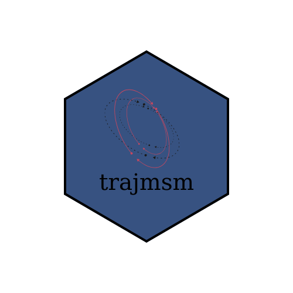

# R-package-trajmsm

  

The `trajmsm` package is inspired by the paper "Marginal Structural Models with Latent Class Growth Analysis of Treatment Trajectories," published in *Statistical Methods for Medical Research*. [Read the paper](https://journals.sagepub.com/doi/pdf/10.1177/09622802231202384). 

Latent Class Growth Analysis (LCGA) is increasingly used to summarize longitudinal treatment data into distinct groups. However, combining LCGA with standard methods like Cox proportional hazards models often fails to control time-dependent confounding due to covariates acting as both confounders and mediators. Our solution employs LCGA to classify individuals into latent classes based on their medication adherence patterns. We then utilize a Marginal Structural Model (MSM) to relate outcomes to these groups. The key parameter is nonparametrically defined, projecting the true MSM onto the selected working model.

Integrating LCGA with MSM (termed LCGA-MSM) offers an effective way to describe treatment adherence and control time-dependent confounding. Common methods to estimate MSM parameters include Inverse Probability Weighting (IPW), which creates a pseudo-population for balanced treatment groups. In longitudinal settings, IPW adjusts for time-varying covariates impacted by previous exposures and selection bias.

In this initial version of `trajmsm`, we estimate LCGA-MSM parameters using IPW, g-computation, and pooled Longitudinal Targeted Maximum Likelihood Estimation (LTMLE). We also introduce an extension for time-dependent outcomes, termed LCGA-History-Restricted MSM (LCGA-HRMSM), with the same three estimators.

For access to the R codes, visit our [GitHub repository](https://github.com/awamaeva/R-package-trajMSM).

For additional insights on trajectory analysis, check out the [trajectory_analysis repository](https://github.com/awamaeva/trajectory_analysis).
